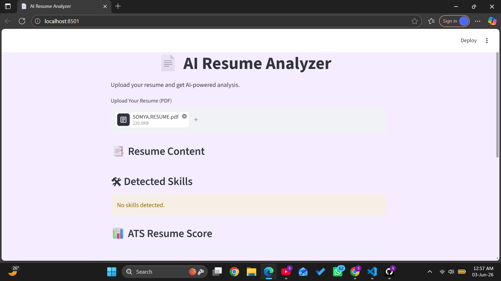

# AI Resume Analyzer 🚀

An AI-powered Resume Analyzer built using Python and Streamlit that analyzes resumes, detects skills, and provides ATS-based scoring.

## 🔥 Features
- Upload Resume PDF
- Extract Resume Text
- Detect Technical Skills
- ATS Resume Score
- Resume Improvement Suggestions

## 🛠 Technologies Used
- Python
- Streamlit
- pdfplumber
- PyPDF2

## 📌 Future Improvements
- AI-based Resume Suggestions
- NLP Skill Extraction
- Job Recommendation System
- Resume Ranking

## 👩‍💻 Developed By
Somya Shruti

## 📷 Project Screenshot
(Add screenshot here later)
## 🌐 Live Demo

[Open App](https://ai-resume-analyzer-4k9mkre6wec9pu2hqiprsf.streamlit.app/)

## 📂 GitHub Repository

[View Project](https://github.com/shrutisomya82-oss/AI-Resume-Analyzer)(Add screenshot here later)